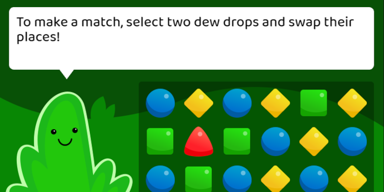
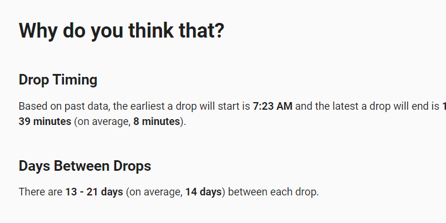

# Hello!

My name is **Logan Franken**.
I'm a **full-stack web developer**.

Learn a little more <a href="/about">about me</a> or check out a couple of my recent projects:

## Dew Drop Swap

A **match three-style game** created with Phaser, a JavaScript game framework.
<a href="https://loganfranken.itch.io/dew-drop-swap" aria-label="Play Dew Drop Swap">Play it</a> for yourself,
check out the <a href="https://github.com/loganfranken/dew-drop-swap" aria-label="source code for Dew Drop Swap">code</a>,
or read my <a href="https://www.loganfranken.com/blog/1660/dew-drop-swap/" aria-label="blog post about Dew Drop Swap">blog post</a> about it.

## Best Buy RTX 3070 Drop Predictor

A **small React application** I created to try and predict the
next time a RTX 3070 would go on sale on the Best Buy website. View the
<a href="https://loganfranken.github.io/best-buy-rtx-3070/" aria-label="live version of the Best Buy RTX 3070 Predictor application">live version</a>
or check out the <a href="https://github.com/loganfranken/best-buy-rtx-3070" aria-label="source code for the Best Buy RTX 3070 Predictor application">code</a>.